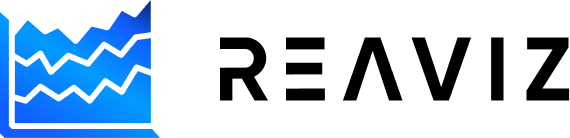

<p align="center">
  
  <br />
  Data visualization library for React
  <br /><br />
  <a href="https://github.com/reaviz/reaviz/workflows/build/">
    
  </a>
  <a href="https://npm.im/reaviz">
    
  </a>
  <a href="https://npm.im/reaviz">
    
  </a>
  <a href="https://github.com/reaviz/reaviz/blob/master/LICENSE">
    
  </a>
  <a href="https://discord.gg/tt8wGExq35">
    
  </a>
  <a href="https://opencollective.com/reaviz">
    
  </a>
</p>

---

REAVIZ is a modular chart component library that leverages
React natively for rendering the components while using D3js under the
hood for calculations. The library provides an easy way to get started
creating charts without sacrificing customization ability.

## 🚀 Quick Links

- [Website](https://reaviz.dev)
- [Docs](https://reaviz.dev/docs)
- [Blocks](https://reaviz.dev/blocks)
- [Storybook](https://storybook.reaviz.dev)
- [Changelog](CHANGELOG.md)

## 🏗️ Other Projects

- [Reagraph](https://reagraph.dev?utm=reaviz) - Open-source library for large webgl based network graphs.
- [Reablocks](https://reablocks.dev?utm=reaviz) - Open-source component library for React based on Tailwind.
- [Reaflow](https://reaflow.dev?utm=reaviz) - Open-source library for workflow and diagram graphs.
- [Reachat](https://reachat.dev?utm=reaviz) - Open-source library for building LLM/Chat UIs for React.

## ✨ Features

Chart types include:

- Bar Chart
  - Single Series Vertical / Horizontal
  - Multi Series Vertical / Horizontal
  - Stacked Vertical / Horizontal
  - Stacked Normalized Vertical / Horizontal
  - Stacked Diverging Vertical / Horizontal
  - Marimekko
  - Radial
  - Sparkline
  - Waterfall
- Line Chart
  - Single Series
  - Multi Series
  - Stacked
  - Stacked Normalized
  - Radial
  - Sparklines
- Area Chart
  - Single Series
  - Multi Series
  - Stacked
  - Stacked Normalized
  - Radial
  - Sparklines
- Scatter Chart
  - Linear
  - Radial
- Pie Chart
  - Standard
  - Exploded
  - Donut Chart
- Sankey chart
- Gauge
  - Radial
  - Linear
  - Stacked Radial
- Map Chart
- Heatmap
  - Standard
  - Year Calendar
  - Month Calendar
- Venn Diagram
  - Standard
  - Euler
  - Fixed Euler
- Bubble Chart
- Treemap
- Bar List
- Meter
- Spider / Radar
- Funnel Chart
- Sunburst Chart
- Word Cloud

Additional features:

- Legend
  - Discrete
  - Sequential
- Axis
  - Linear
  - Radial
  - Advanced Label Positioning
- Gestures
  - Pinch
  - Pan
  - Zoom
  - Move
- Tooltip
  - Single Value
  - Grouped Values
- Line/Area Series Symbols
- Animations Enter/Update/Exit
- Brush
- Patterns
- Gradients
- Grid Lines
- Mark Lines
- BigInt Support
- Auto Sizing
- Bar Guidelines
- Range Lines
- Animated Counts
- a11y Support for labels, roles and tabbing
- SSR

## 📦 Install

To use reaviz in your project, install it via npm/yarn:

```
npm i reaviz --save
```

then import a chart type into your JSX element:

```jsx
import { BarChart } from 'reaviz';

const data = [
  { key: 'IDS', data: 14 },
  { key: 'Malware', data: 5 },
  { key: 'DLP', data: 18 }
];

const App = () => <BarChart width={350} height={250} data={data} />;
```

Visit the [docs](https://reaviz.dev/docs) to learn more!

## 🔭 Development

If you want to run REAVIZ locally, its super easy!

- Clone the repository
- `npm i`
- `npm start`
- Browser opens to Storybook page

## ❤️ Contributors & Credits

Thanks to all our contributors!

<a href="https://github.com/reaviz/reaviz/graphs/contributors"></a>

